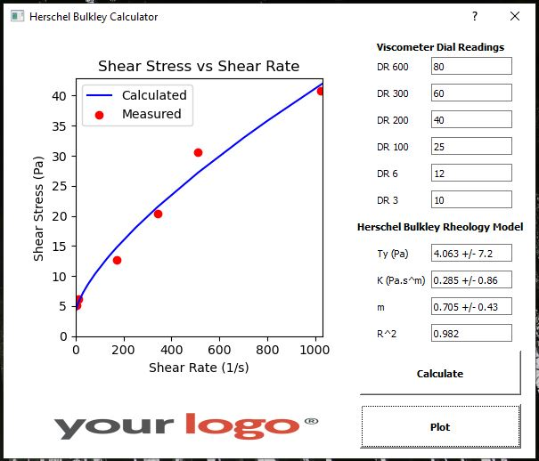

# Herschel Bulkley Calculator

Herschel Bulkley Calculator is a user interface which calculates a fluid's rheological properties (yield stress, consistency index and flow behavior index) by the 6 viscometer readings using the Herschel-Bulkley fluid rheology model (which can also be used for power-law, bingham plastic and newtonian fluids).


## Installation

In the Linode terminal from the home directory, use the command git clone, then paste the link from your clipboard, or copy the command and link from below:

```bash
git clone https://github.com/sercangul/Herschel-Bulkley-GUI.git
```

Change directories to the new ~/Herschel-Bulkley-GUI directory:

```bash
cd ~/Herschel-Bulkley-GUI/
```

To ensure that your master branch is up-to-date, use the pull command:

```bash
git pull https://github.com/sercangul/Herschel-Bulkley-GUI.git master
```

Install required python packages using requirements.txt:

```bash
pip install -r requirements.txt
```

## Usage

Change directories to the new ~/Herschel-Bulkley-GUI directory:

```bash
cd ~/Herschel-Bulkley-GUI/
```

Run the script using Python:

```bash
python run.py
```


The program will automatically run and provide the following screen to enter viscometer readings:



Enter the 6 viscometer readings obtained from an R1B1 viscometer. 

Press calculate.

Press plot.

## Contributing
Pull requests are welcome. For major changes, please open an issue first to discuss what you would like to change.

Please make sure to update tests as appropriate.

## License
[Apache 2.0](https://choosealicense.com/licenses/apache-2.0/)
